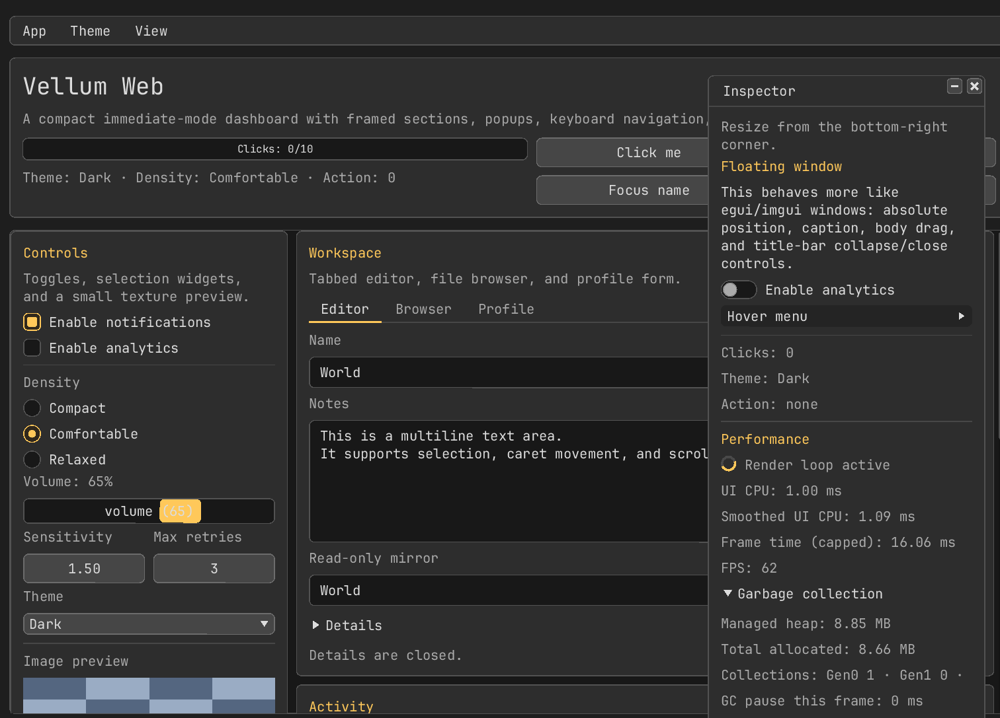
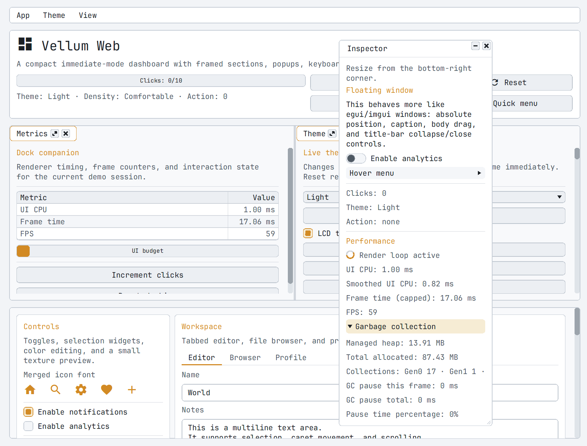

# Vellum

[](https://github.com/notgiven688/vellum/actions/workflows/tests.yml)
[](https://www.nuget.org/packages/VellumUI/)

`Vellum` is a backend-neutral immediate-mode GUI library for C#.

🌐 [Interactive Web Demo](https://notgiven688.github.io/vellum/) ·
📚 [Documentation](https://notgiven688.github.io/vellum/docs/) ·
📦 [NuGet Package](https://www.nuget.org/packages/VellumUI/)





## Motivation

The C# ecosystem does not really have a first-class immediate-mode GUI library. Dear ImGui is excellent, but from C# it usually means a C wrapper plus a .NET binding. Vellum exists for cases where a small C# UI layer is enough.

The original goal was rendering a UI window inside the [Jitter Physics](https://github.com/notgiven688/jitterphysics2) demo without pulling in a native GUI stack.

Immediate-mode GUI libraries are shallow by nature: apart from font rendering, most of the work is direct layout, input state, and draw command generation. That makes Vellum a useful experiment in how far AI can take a focused library like this. Most of the repository was written by ChatGPT/Codex, so treat it as experimental software and review it accordingly.

## Quick Example

State lives in your own variables, and you redraw the UI each frame. A host backend is responsible for window creation, input collection, and implementing `IRenderer`.

```csharp
using System.Numerics;
using Vellum;
using Vellum.Rendering;

IRenderer renderer = /* your backend */;
var ui = new Ui(renderer)
{
    Theme = ThemePresets.Dark()
};

var state = new AppState();

while (app.Running)
{
    Vector2 mousePos = app.MousePosition;
    UiInputState input = app.UiInput;

    ui.Frame(app.Width, app.Height, mousePos, input, state, static (root, state) =>
    {
        root.FillViewport(root.Theme.SurfaceBg);

        using (root.MaxWidth(420f, UiAlign.Center))
        {
            root.Panel(root.AvailableWidth, state, static (panel, state) =>
            {
                panel.Heading("Hello");
                panel.Label("Vellum is immediate-mode.");
                panel.Spacing(8f);

                if (panel.Button("Increment").Clicked)
                    state.Clicks++;

                panel.Label($"Clicks: {state.Clicks}");
            });
        }
    });

    bool wantsMouse = ui.WantsCaptureMouse;
    bool wantsKeyboard = ui.WantsCaptureKeyboard;
}

sealed class AppState
{
    public int Clicks;
}
```

## What Is Here

- the core UI library
- the default OpenTK desktop demo
- the Raylib browser demo
- the generated documentation and widget gallery
- the built-in TrueType parser/rasterizer used by the text system

The NuGet package contains the core UI library. The demos and gallery generator live in this repository.

The current library already includes:

- labels, panels, buttons, checkboxes, switches, and radio buttons
- selectables, combo boxes, sliders, drag controls, color pickers, histograms, progress bars, and spinners
- text fields and multiline text areas
- menu bars, cascading menus, shortcut gutters, popups, and modal popups
- vertical and both-axis scroll areas
- tabs, tree views, movable windows, dock spaces, tooltips, and a custom canvas/painter path

The basic functionality is there. The remaining work is mostly polish, hardening, broader backend coverage, and deeper edge-case testing.

The core library also ships two built-in theme presets: `ThemePresets.Dark()` and `ThemePresets.Light()`.

## Windows And Docking

Windows keep persistent position, size, collapse, and close state in `WindowState`. Docking is opt-in through `DockingState`; once assigned to `Ui.Docking`, declared windows can be dragged into a `DockSpace`.

```csharp
var docking = new DockingState();
var inspector = new WindowState(new Vector2(40f, 40f), new Vector2(320f, 220f));

ui.Docking = docking;

ui.Frame(width, height, mouse, input, root =>
{
    root.DockSpace("main-dock", root.AvailableWidth, 360f);

    root.Window("Inspector", inspector, 320f, body =>
    {
        body.Label("Selected entity");
    }, resizable: true);
});
```

## Fonts

Vellum brings its own lightweight text renderer, TrueType loader, glyph rasterizer, and glyph atlas management. Backends receive text as normal textured geometry through `IRenderer`; they do not call platform text APIs or shape text themselves.

Custom TrueType fonts can be loaded directly:

```csharp
ui.Font = TrueTypeFont.FromFile("MyFont.ttf");
```

If `ui.Font` is not set, `Vellum` uses an embedded default font shipped inside the library. The default is exposed as `UiFonts.DefaultSans` and comes from the embedded `JetBrainsMono-Regular.ttf` resource in the core project.

Backends running on HiDPI displays should pass `RenderFrameInfo` with both logical and framebuffer sizes. By default, `ui.AutoTextRasterScale` updates `ui.TextRasterScale` from that frame scale so text atlases are rasterized at the correct density.

The text stack is deliberately small: it supports basic TrueType glyph lookup, rasterization, wrapping, clipping, ellipsis, text fields, and text areas, but it is not a full shaping engine. See [Text and Fonts](docs/docs/guides/text-and-fonts.md) for the exact supported and unsupported cases.

## Build

```bash
dotnet build src/vellum.slnx
```

Run the default OpenTK demo:

```bash
dotnet run --project src/Vellum.Demo/Vellum.Demo.csproj
```

## Acknowledgements

`Vellum` draws direct inspiration from a few projects that helped define the shape of this space:

- Dear ImGui, for the practical immediate-mode GUI model and the overall sense of scope.
- egui, for showing what a compact immediate-mode GUI library can look like in a higher-level language.
- `stb_truetype.h`, for the font parsing and rasterization model that informed the built-in text stack.
