# Widget Gallery

This page is generated from curated widget examples in `other/Vellum.WidgetGallery`. Each screenshot is rendered headlessly through `Vellum.SoftwareRendering`.

## Text

### Heading

| Dark | Light |
| --- | --- |
| 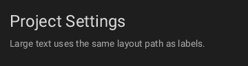 | 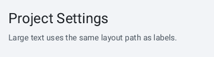 |

### Label

| Dark | Light |
| --- | --- |
| 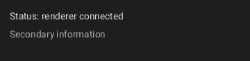 | 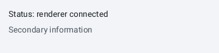 |

### Separator

| Dark | Light |
| --- | --- |
| 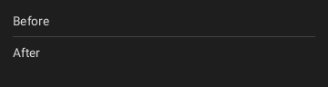 | 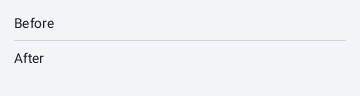 |

## Controls

### Button

| Dark | Light |
| --- | --- |
|  | 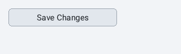 |

### Checkbox

| Dark | Light |
| --- | --- |
| 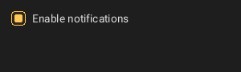 | 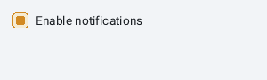 |

### Combo Box

| Dark | Light |
| --- | --- |
| 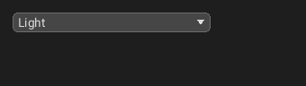 | 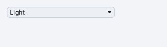 |

### DragFloat

| Dark | Light |
| --- | --- |
| 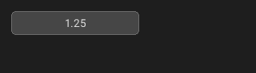 | 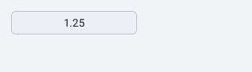 |

### DragInt

| Dark | Light |
| --- | --- |
| 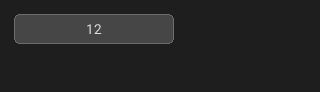 | 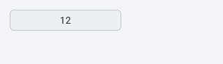 |

### Radio Button

| Dark | Light |
| --- | --- |
| 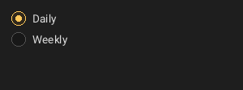 | 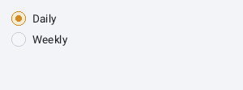 |

### Selectable

| Dark | Light |
| --- | --- |
| 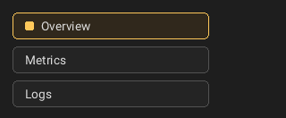 | 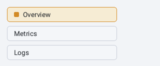 |

### Slider

| Dark | Light |
| --- | --- |
| 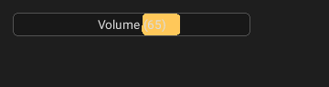 | 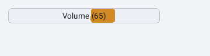 |

### SliderInt

| Dark | Light |
| --- | --- |
| 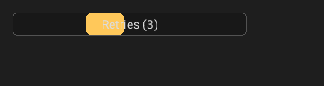 | 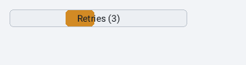 |

### Switch

| Dark | Light |
| --- | --- |
| 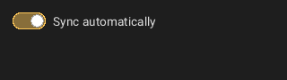 | 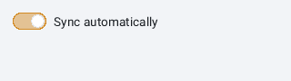 |

## Status

### Histogram

| Dark | Light |
| --- | --- |
| 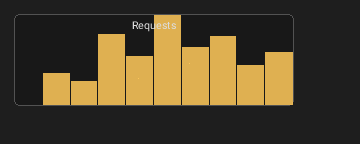 | 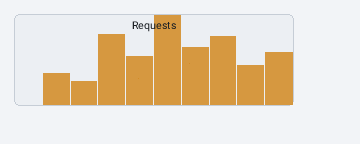 |

### ProgressBar

| Dark | Light |
| --- | --- |
|  | 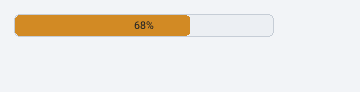 |

### Spinner

| Dark | Light |
| --- | --- |
| 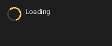 | 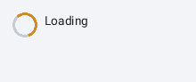 |

## Input

### TextArea

| Dark | Light |
| --- | --- |
| 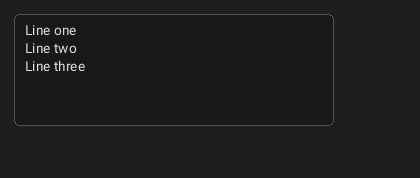 | 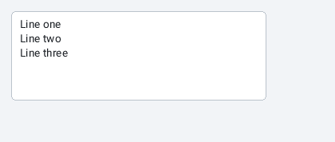 |

### TextField

| Dark | Light |
| --- | --- |
| 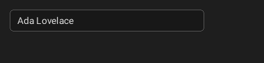 | 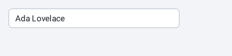 |

## Layout

### Canvas

| Dark | Light |
| --- | --- |
| 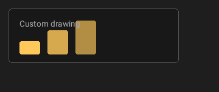 | 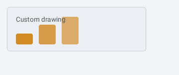 |

### Panel

| Dark | Light |
| --- | --- |
| 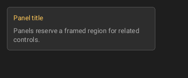 | 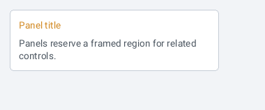 |

### ScrollArea

| Dark | Light |
| --- | --- |
| 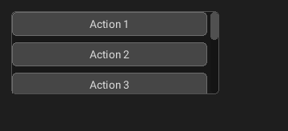 | 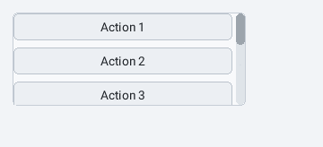 |

### ScrollAreaBoth

| Dark | Light |
| --- | --- |
| 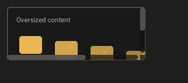 | 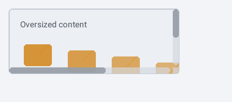 |

### Splitter

| Dark | Light |
| --- | --- |
| 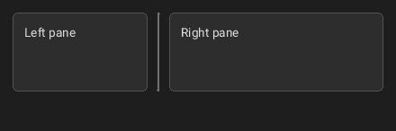 | 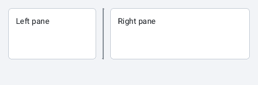 |

## Media

### Image

| Dark | Light |
| --- | --- |
| 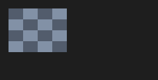 | 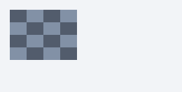 |

## Navigation

### CollapsingHeader

| Dark | Light |
| --- | --- |
| 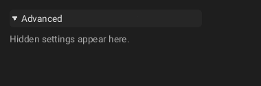 | 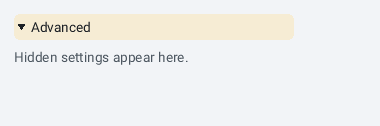 |

### TabBar

| Dark | Light |
| --- | --- |
| 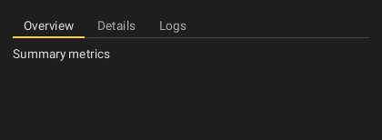 | 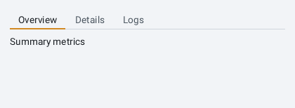 |

### Tree

| Dark | Light |
| --- | --- |
|  |  |

## Menus

### MenuBar

| Dark | Light |
| --- | --- |
|  |  |

## Windows

### Window

| Dark | Light |
| --- | --- |
|  |  |

